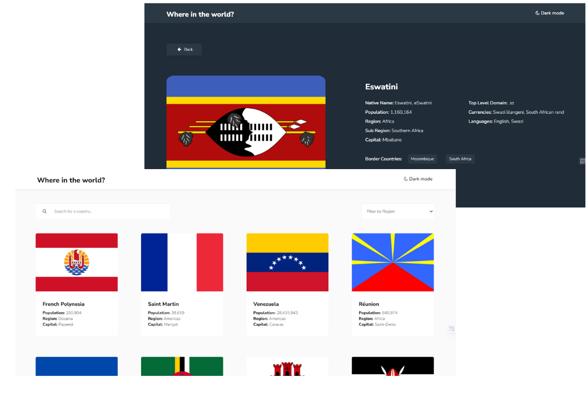
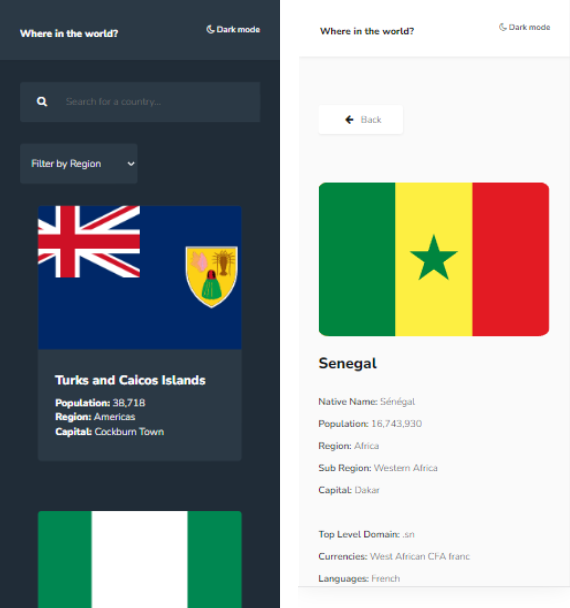

# - REST Countries API

The challenge is to integrate with the [REST Countries V2 API](https://restcountries.com/#api-endpoints-v2) to pull country data and display it like in the designs (Figma file). I was required to use the Angular +
TypeScript front-end framework. However, I have complete control over which
packages you use to do things like make HTTP requests or style your project.

## Table of contents

- [Overview](#overview)
  - [The challenge](#the-challenge)
  - [Screenshot](#screenshot)
  - [Links](#links)
- [My process](#my-process)
  - [Built with](#built-with)
  - [What I learned](#what-i-learned)
  - [Continued development](#continued-development)
  - [Useful resources](#useful-resources)
- [Author](#author)

## Overview


### The challenge

Users should be able to:

- View the optimal layout for the site depending on their device's screen size
- See all countries from the API on the homepage
- Search for a country using an **input** field
- Filter countries by region
- Click on a country to see more detailed information on a separate page
- Filter countries by region
- Toggle the colour scheme between light and dark mode

### Screenshot


**_Desktop View_**

<figure>
    
   
</figure>

**_Mobile View._**

<figure>
    
    
</figure>

### Links

- Solution URL: [REST Countries API](https://rest-country-api-25202.web.app)
- GitHub Repo: [Link to the GitHub Repo](https://github.com/fidelismensah/REST-Countries-API)

## My process

### Built with

- Semantic HTML5 markup
- CSS custom properties
- Flexbox
- CSS Grid
- [Font Awesome](https://fontawesome.com)
- [Bootstrap](https://getbootstrap.com/) - CSS Framework
- [TypeScript](https://nextjs.org/) - JS Compiler
- [Angular](https://angular.io/) - JS Framework
- [Firebase](https://quicktype.io/) - For Hosting the Site
- [REST Countries API](https://restcountries.com/#api-endpoints-v2) - REST API

### What I learned

This section is to provide a recap of some of the major learnings done while working through the project.
The major ones are:
Components
Services
Observables
Routing
Emitter
ngModule
HttpRequest and many others

To see how you can add code snippets, see below:
API & ANGULAR

```html
<h1>Some HTML code I'm proud of</h1>
<div [ngClass]="theme | async" class="app">
  <app-header></app-header>
  <router-outlet></router-outlet>
</div>
```

```css
/* Ways to remove the arrows in an input field*/
/* For WebKit-based browsers */
:root {
  --white: hsl(0, 0%, 100%);
  --l-element: var(--white);
  --d-bg: hsl(207, 26%, 17%);
  --l-text: hsl(200, 15%, 8%);
  --d-text: var(--white);
  --l-bg: hsl(0, 0%, 98%);
}

:host-context(.dark) button {
  background-color: var(--d-element);
  color: var(--d-text);
}
:host-context(.light) button {
  background-color: var(--l-element);
  color: var(--l-text);
}
```

```ts
export class ApiService {
  private api = "https://restcountries.com/v3.1";

  constructor(private http: HttpClient) {}

  getAllCountries() {
    return this.http.get<Country[]>(`${this.api}/all`);
  }

  getCountryByName(name: string) {
    return this.http.get<Country[]>(`${this.api}/name/${name}`).pipe(map(([res]) => res));
  }
  getCountriesByCodes(codes: string[]) {
    return this.http.get<Country[]>(`${this.api}/alpha?codes=${codes.join(",")}`);
  }
}
```

### Useful resources

- [Bootstrap](https://getbootstrap.com/) - This helped me with the the responsiveness and the country card. I really liked how this framework help with the media query.
- [Angular](https://angular.io/) - The project was built with Angular, and on like any other, Angular has features that makes programming easy and provides clean codes.
- [API-Country](https://restcountries.com/#api-endpoints-v2) - Use this to access all the data I needed for the project.
- [The TypeScript Handbook](https://www.typescriptlang.org/docs/handbook/intro.html) - This is an amazing article which helped me finally understand TypeScript. I'd recommend it to anyone still learning this concept. A reader who completes the walkthrough should be able to:
  - Read and understand commonly-used TypeScript syntax and patterns
  - Explain the effects of important compiler options
  - Correctly predict type system behavior in most cases

## Author

- Name - [Fidelis Takyi Mensah](https://www.your-site.com)
- Twitter - [@fidelistakyi](https://www.twitter.com/fidelistakyi)
- LinkedIn - [@fidelistakyi](https://www.linkedin.com/in/fidelis-mensah-3b13291a3?lipi=urn%3Ali%3Apage%3Ad_flagship3_profile_view_base_contact_details%3Bhdp%2BtdxsTjakElRy4MDVTg%3D%3D)

# RESTCountriesAPI

This project was generated with [Angular CLI](https://github.com/angular/angular-cli) version 16.2.0.
